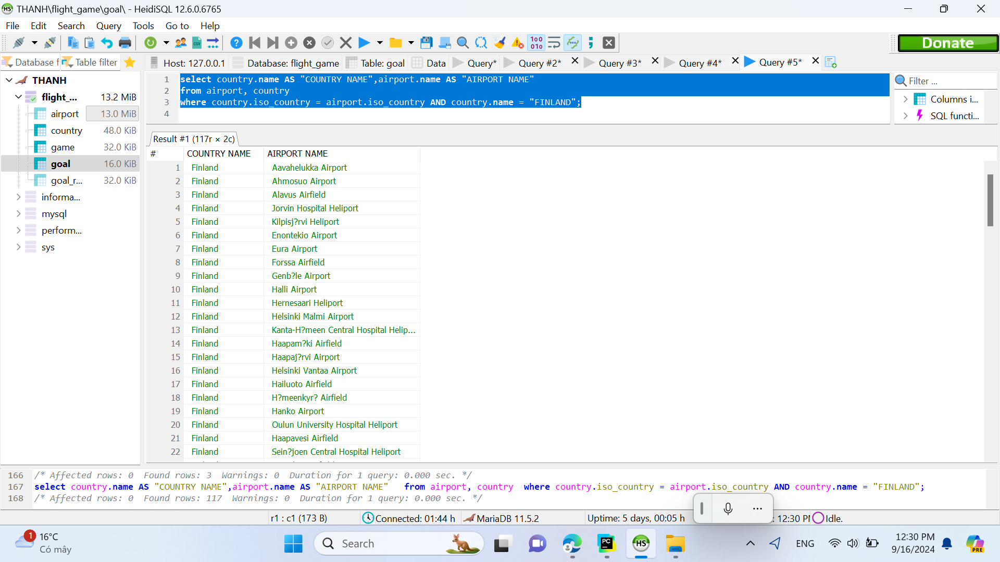
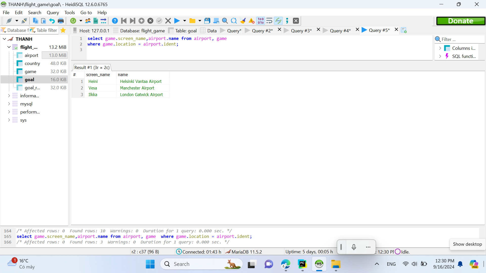
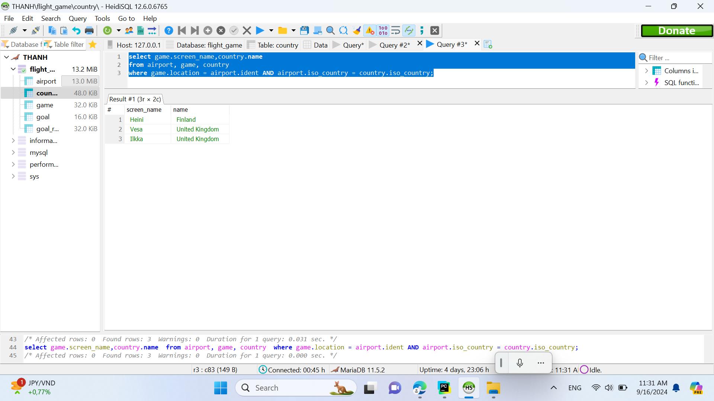
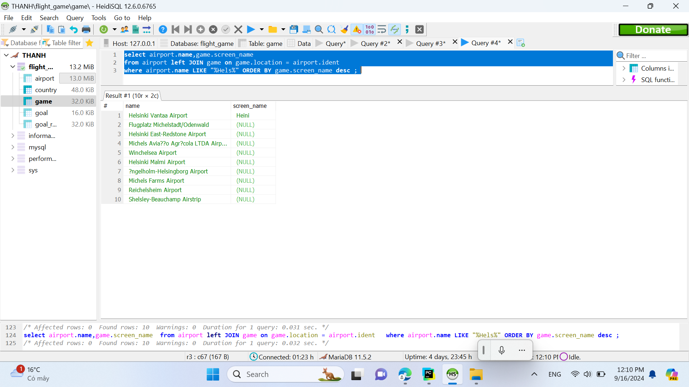
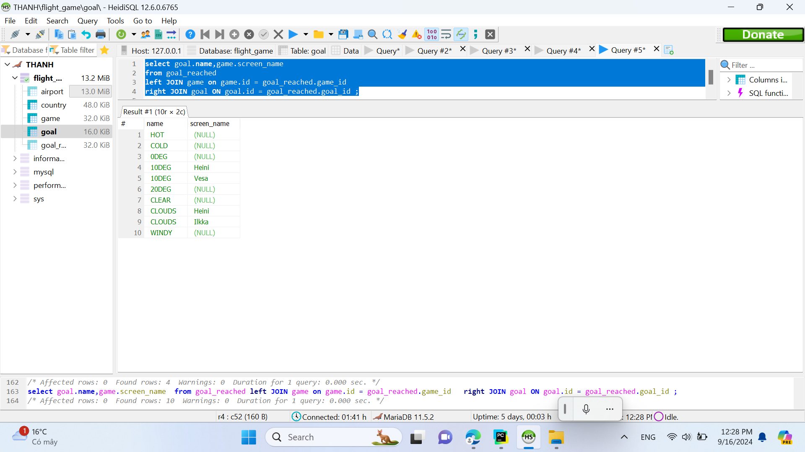
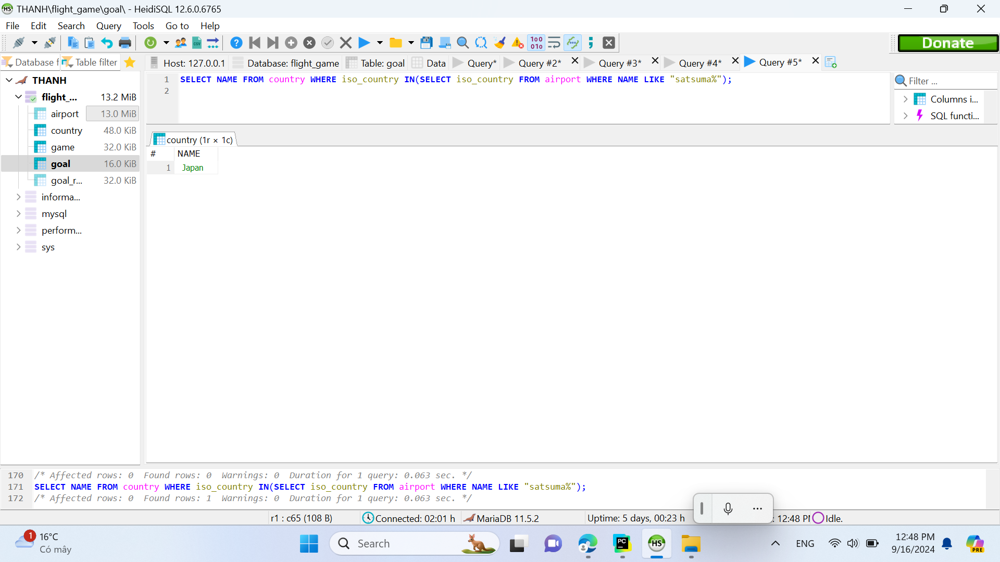
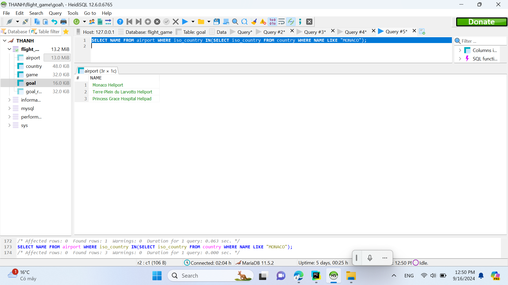
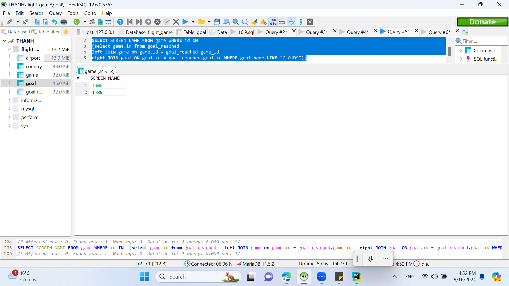
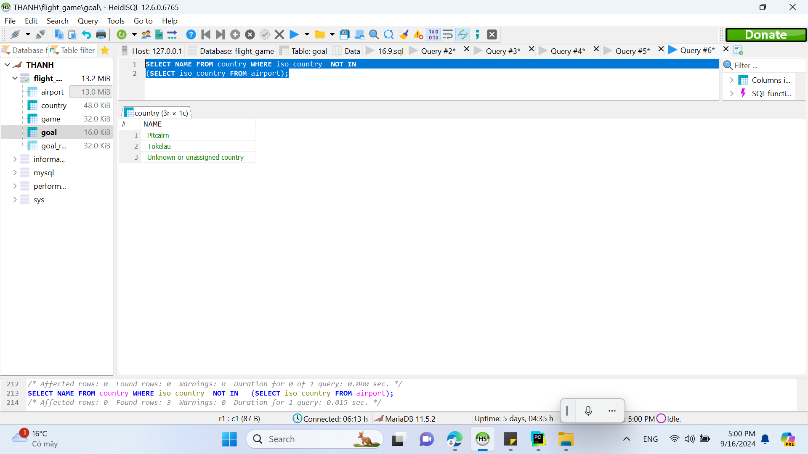
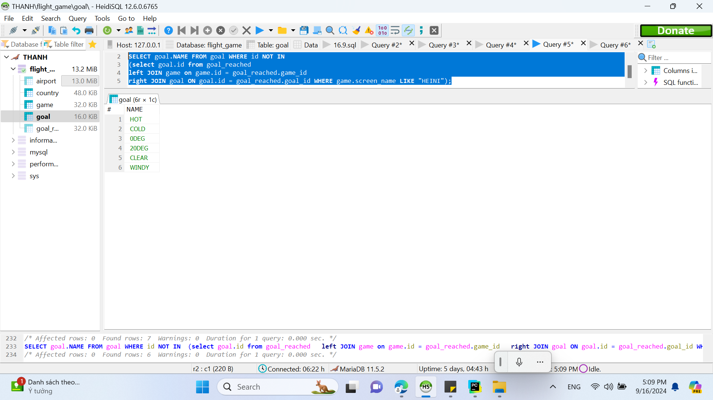

# NAME: THANH HONGTHINGUYEN
# WEEK 4
## SIMPLE QUERY
## EXERCISE 4 - JOIN
# Q1:List all Finnish airports that provide scheduled services. The result must include both the name of the country as well as the name of the airport.
# Hint 1: Country name is Finland.
# Hint 2: You need quotation marks around an alias that consists of several words.
Answer:
select country.name AS "COUNTRY NAME",airport.name AS "AIRPORT NAME" 
from airport, country
where country.iso_country = airport.iso_country AND country.name = "FINLAND";

# Q2:List the names and current airports of all players.
Answer:
select game.screen_name,airport.name from airport, game
where game.location = airport.ident;

# Q3:List the names and current countries of all players.
Answer:
select game.screen_name,country.name from airport, game, country
where game.location = airport.ident AND airport.iso_country = country.iso_country;

# Q4:List the names of all airports that include the string "Hels" and the names of any players that might currently be on any of the listed airports.
Answer:
select airport.name,game.screen_name
from airport left JOIN game on game.location = airport.ident 
where airport.name LIKE "%Hels%" ORDER BY game.screen_name desc ; 

# Q5:List the names of all weather goals and the names of any players that have so far achieved the listed goals.
Answer:
select goal.name,game.screen_name
from goal_reached 
left JOIN game on game.id = goal_reached.game_id 
right JOIN goal ON goal.id = goal_reached.goal_id ;

## EXERCISE 5 - SUBQUERIES
# Q1: One country has an airport where the airport name begins with the word "Satsuma". Print out the name of the country.
Answer:
SELECT NAME FROM country WHERE iso_country IN(SELECT iso_country FROM airport WHERE NAME LIKE "satsuma%");

# Q2:List the names of all airports in Monaco.
Answer:
SELECT NAME FROM airport WHERE iso_country IN(SELECT iso_country FROM country WHERE NAME LIKE "MONACO");

# Q3:List the names of all players who have achieved the clouds goal.
Answer:
SELECT SCREEN_NAME FROM game WHERE id IN
(select game.id from goal_reached 
left JOIN game on game.id = goal_reached.game_id 
right JOIN goal ON goal.id = goal_reached.goal_id WHERE goal.name LIKE "CLOUDS");

# Q4:List all countries that have no airports.Hint: You need to use the negation NOT IN.
Answer:
SELECT NAME FROM country WHERE iso_country  NOT IN (SELECT iso_country FROM airport);

# Q5:Which weather goals has Heini not achieved yet? Hint: You need to use the negation NOT IN.
Answer:
SELECT goal.NAME FROM goal WHERE id NOT IN
(select goal.id from goal_reached 
left JOIN game on game.id = goal_reached.game_id 
right JOIN goal ON goal.id = goal_reached.goal_id WHERE game.screen_name LIKE "HEINI");
