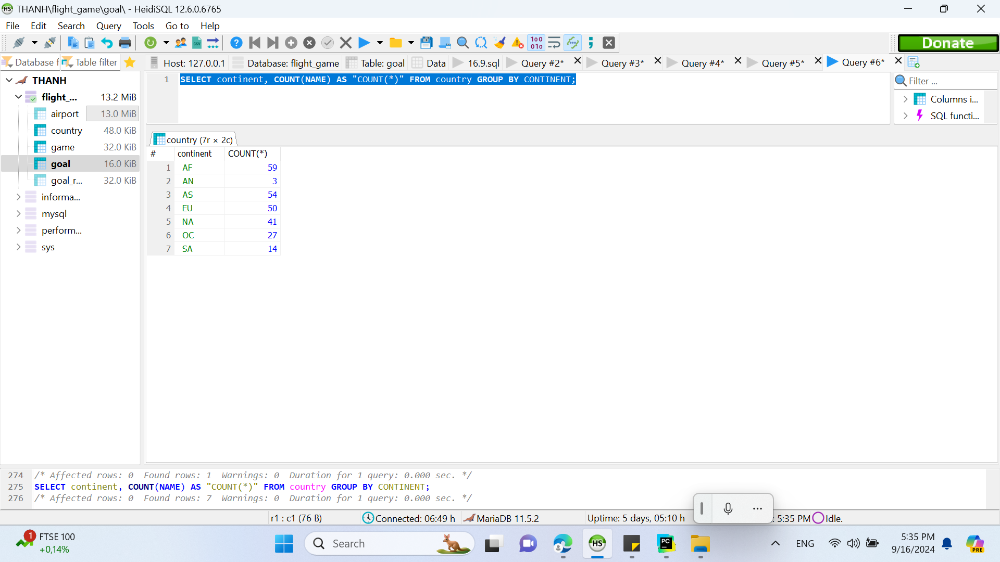
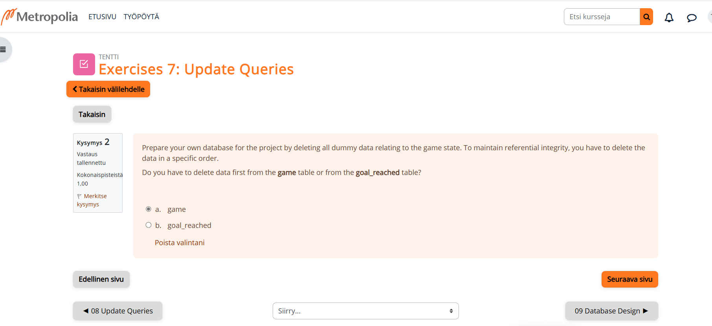
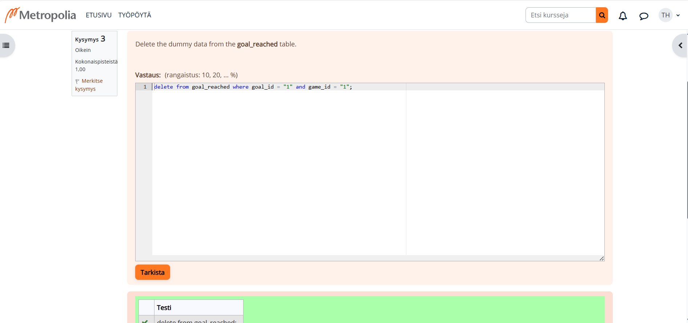

# NAME: THANH HONGTHINGUYEN
# WEEK 5
## SIMPLE QUERY
## EXERCISE 6 - AGGREGATE QUERIES

# Q1:What is the elevation of the highest airport location?
Answer:
SELECT max(elevation_ft) FROM airport WHERE elevation_ft IN(SELECT elevation_ft FROM airport) LIMIT 1;

# Q2:Write a query that lists all continents and the number of countries on them.
Answer:
SELECT continent, COUNT(NAME) AS "COUNT(*)" FROM country GROUP BY CONTINENT;

# Q3:List the names of all players and the number of weather goals they have achieved.
Answer:
SELECT screen_name, COUNT(goal.name) AS "COUNT(*)" 
FROM game, goal, goal_reached
WHERE game.id = goal_reached.game_id AND goal.id = goal_reached.goal_id 
GROUP BY screen_name;

# Q4:Which player has the smallest carbon foot print?
# Hint 1: Do not use the desc limit if there are multiple airports with the same elevation: desc limit only selects one of them. You need all airports with the highest elevation.
# Hint 2: You need to perform a subquery even though your query only targets one table.
Answer:
SELECT screen_name FROM game WHERE co2_consumed IN(SELECT MIN(co2_consumed) FROM game) LIMIT 1;

# Q5:Print out the names of all countries and the number of airports in each country. Order the results by the airport count in descending order. Only include the top 50 countries with the largest number of airports.
Answer:
SELECT country.NAME, COUNT(airport.name) AS "COUNT(*)" FROM country, airport
WHERE country.iso_country = airport.iso_country
GROUP BY country.name
ORDER BY country.name desc 
LIMIT 50;

# Q6:List the countries with more than 1000 airports. Use the iso_country field in the query.
Answer:
SELECT country.name
FROM country, airport
WHERE country.iso_country = airport.iso_country
GROUP BY country.name
Having COUNT(*) >=1000 ;

# Q7:Print out the name of the highest airport in the world.
# Hint 1: Do not use desc limit. In case there are several airports with the same elevation value, desc limit only select one of them.
# Hint 2: You need to perform a subquery even though the query only targets one table.
Answer:
SELECT name FROM airport WHERE elevation_ft IN(SELECT max(elevation_ft) FROM airport) LIMIT 1;

# Q8:In which country does the highest airport reside in?
# Hint 1: Do not use desc limit. If there are several airports with the same elevation value, desc limit only selects one of them.
# Hint 2: Use subqueries.
Answer:
SELECT country.name FROM country,airport
WHERE elevation_ft IN(SELECT max(elevation_ft) FROM airport)
AND country.iso_country = airport.iso_country
LIMIT 1;

# Q9:How many weather goals has Vesa achieved so far?
Answer:
SELECT COUNT(goal.name) AS "COUNT(*)" 
FROM game, goal, goal_reached
WHERE game.id = goal_reached.game_id AND goal.id = goal_reached.goal_id 
AND screen_name = "Vesa";

# Q10:What is the name of the airport that resides closest to the polar regions?
# Hint: The latitude value of both the north and south pole is 0.
Answer:
SELECT name FROM airport WHERE latitude_deg IN(SELECT min(LATITUDE_DEG) FROM airport) ;

## EXERCISE 7 - UPDATE QUERIES
# Q1:Vesa flies from his current location to the Nottingham Airport. At the same time, Vesa's carbon footprint increases by 500. Update the information to the database.
# Hint 1: You need to use a subquery to find out the ident value of Nottingham Airport.
Answer:
 update game
 set co2_consumed = co2_consumed +500,
 location = (select IDENT from AIRPORT where name = "Nottingham Airport")
 where screen_name = "vesa";
 SELECT*FROM game;

# Q2:
Answer:

# Q3:Delete the dummy data from the goal_reached table.
Answer:

# Q4:Delete the data from the game table
Answer:

